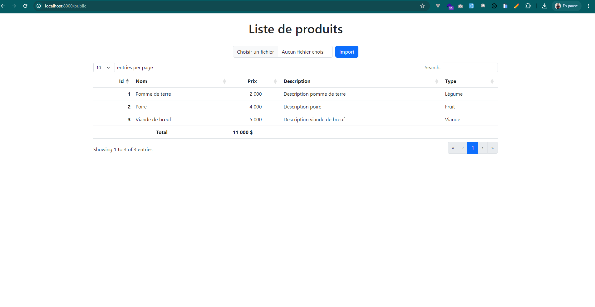

## Etape à suivre pour lancer le projet
1. Cloner le projet
2. Créer et importer la base de données dans votre serveur MySQL (Vous trouverez le fichier sql dans le dossier backup-db)
3. Configurer le fichier Database.php dans le dossier app/config avec vos informations de connexion à la base de données
4. Installer les dépendances
5. Lancer le projet
6. Enjoy

## Pour installer les dépendances du projet, exécutez la commande suivante :
1. cd /path/to/project
2. Composer install

## Pour lancer le projet utiliser la commande suivante

```bash
php -S localhost:8000
```


## Pour accéder à l'application
1. Ouvrir un navigateur
2. Taper l'url suivante : http://localhost:8000

## Voici les captures d'écran de l'application





### Détails du projet

On a un excel contenant des produits ( données brutes ).
Un produit a un nom, courte description, un prix en $, un type ( beauté, alimentaire, vestimentaire ) 

1. Construisez le domaine métier pour l'énoncé ci-dessus
2. Insérer les données du fichier excel dans une bdd de votre choix
3. Construisez une simple page pour afficher la liste des produits

### Technologies utilisées
- PHP >= 8.0
- Composer
- Bootstrap 5
- MySQL